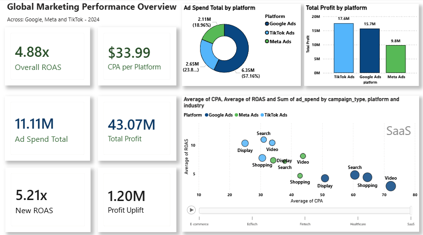
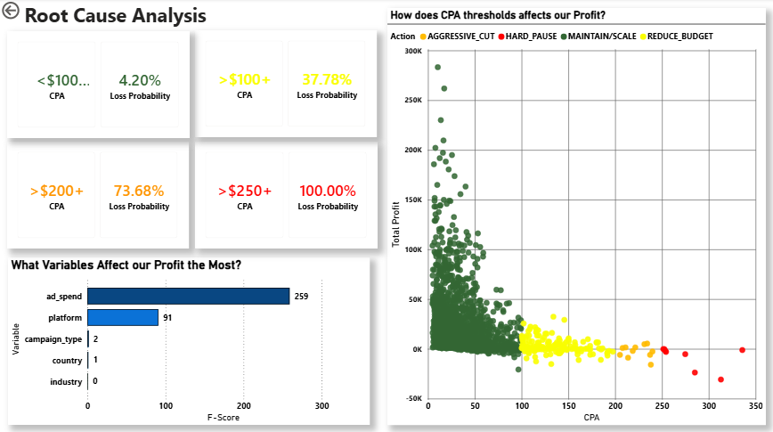

# 📊 Data-Driven-Marketing-Capital-Optimization

> **Data-driven marketing optimization framework that analyzes ROAS, profitability, and campaign efficiency to identify capital at risk. Built with Python and SQL, the reallocation engine simulates a theorical $1.2M profit optimization and improves ROAS from 4.88X to 5.21X.**

## 📌 Executive Summary
This project identifies capital-at-risk within a global digital advertising portfolio ($54M Revenue / 4.88X baseline ROAS) and algorithmically reallocates day-by-day wasted spend to high-performing assets using strict financial guardrails. By employing a micro-simulation engine and ANOVA sensitivity testing to know what drives profit, the final model demonstrates significant profit optimization while strictly decreasing total capital exposure.

## 🛠️ The Tech Stack & Data Pipeline
This project features a complete end-to-end data architecture and analysis, transitioning raw campaign data into a production-ready risk management engine:

**1. Data Ingestion & SQL Transformation**
* **The Raw Data:** Extracted the original `global_ads_performance_dataset`, consisting of 14 columns (date, platform, campaign_type, industry, country, impressions, clicks, CTR, CPC, ad_spend, conversions, CPA, revenue, ROAS) and 1,800 rows of individual campaigns.
* **Data Cleaning (SQLite):** Imported the raw data into an SQLite relational database to perform rigorous data cleaning and schema enforcement:
  * *DDL Schema Enforcement:* Created a Fact Table (`fct_ads_performance`) with strict data types and `CHECK` constraints to ensure business logic integrity (e.g., preventing mathematically impossible scenarios like `clicks > impressions`).
  * *DML Migration & Standardization:* Sanitized categorical variables using `TRIM()` and migrated the data.
  * *Analytics View Creation:* Engineered a `vw_performance_metrics` view to serve as a "Single Version of Truth." This layer calculates dynamic KPIs (Net Profit, Profit Margin, ROAS, CTR) using `NULLIF()` to safely prevent division-by-zero errors.

**2. Python Statistical Engine**
* **Advanced Analytics:** The cleaned SQL view was exported into Python (`marketing_budget_optimization_audit.ipynb`) for advanced statistical analysis.
* **The Logic:** Utilizing Pandas and SciPy, the engine conducts defensive data auditing, variance analysis, and ANOVA sensitivity testing to isolate statistically significant performance drops. It then applies a Surgical Reallocation Algorithm to shift capital from inefficient campaigns into high-yield alternatives based on strict CPA guardrails.

**3. Business Visualization (Power BI)**
* **Final Deliverables:** The finalized Python simulation outputs and optimized daily reallocation ledgers were exported as clean CSVs.
* **Dashboarding:** These datasets were ingested into Power BI to construct the final interactive executive dashboard, visually illustrating the financial shift from the 4.88X baseline to the optimized 5.21X ROAS.

## 📈 Executive Dashboard


## 🎯 Risk Management & Key Findings
To uncover hidden daily inefficiencies across Google Ads, Meta Ads, and TikTok Ads, this project quantified variance and risk at a granular level to answer the core question: *Does a highly profitable environment still hide capital inefficiencies and risk?*
* **CPA Profitability Thresholds:** Identified the exact Cost Per Acquisition (CPA) boundaries for each platform where campaigns cross from profitable returns into negative expected value.
* **Probability of Loss:** Modeled the statistical probability of a campaign losing capital under specific daily conditions. By treating campaign variance as a measurable metric, the engine automatically cuts funding to channels that exceed acceptable risk limits.
* **The Core Mechanism:** We demonstrate that top-of-funnel campaign efficiency (clicks, impressions, and CTR) remains stable, but rising CPAs push capital into negative-yield risk zones. The engine mitigates this by dynamically shifting budget to more cost-effective daily alternatives.



## ⚙️ Methodology & Engine Mechanics
1. **Defensive Data Auditing:** Custom Python functions (`check_data_quality`) were built to differentiate between logical overlaps and technical duplicates, ensuring absolute data integrity before any financial models were applied.
2. **ANOVA Sensitivity Testing:** Conducted statistical variance tests to ensure that the performance differences between channels were statistically significant, preventing the algorithm from chasing random noise.
3. **Anomaly Detection:** Identified 136 losing campaign-days across the dataset. Conducted a *Metric Variance: Baseline vs. Anomaly* statistical analysis, demonstrating that isolated spikes in bottom-of-funnel costs (CPA), rather than top-of-funnel engagement, were the primary drivers of negative ROI.
4. **Surgical Reallocation Algorithm:** Engineered a script that shifts capital away from mathematically inefficient campaigns into high-yield avenues on the exact same day. The algorithm is bounded by strict financial guardrails to prevent over-allocation and diminishing returns.

## 📦 Key Outputs & Deliverables
The Python engine programmatically generates a suite of clean, analytical CSV datasets for downstream BI integration:
* `vw_performance_metrics.csv`: The cleaned and validated baseline dataset.
* `anova_results.csv`: Results from the statistical variance testing.
* `136_losing_days.csv`: Isolated subset of mathematically inefficient campaign-days.
* `metric_variance.csv`: Statistical comparison profiling baseline performance versus anomalies.
* `cpa_threshold_sensitivity.csv`: Probability audit detailing platform-specific CPA risk boundaries.
* `surgical_strategy_full_audit.csv`: The complete 3-Tier action plan detailing capital-at-risk and required adjustments.
* `daily_reallocation_ledger.csv`: The final optimized reallocation engine output ready for BI ingestion.

## 📁 Repository Structure
```text
├── data/
│   ├── global_ad_ops_warehouse.db           # Raw SQLite database
│   └── global_ads_performance_dataset.csv   # Exported raw metrics
├── notebooks/
│   └── marketing_budget_optimization_audit.ipynb  # Core engine & Python logic
├── Dashboards/
│   └── Data Analytics Marketing.pbix        # Interactive Power BI dashboard
└── README.md
